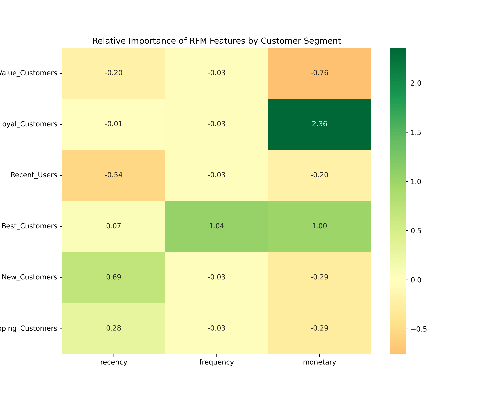
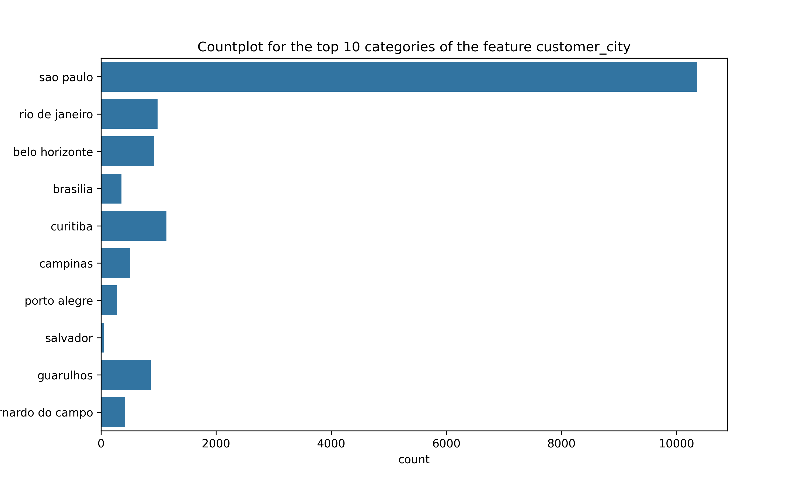
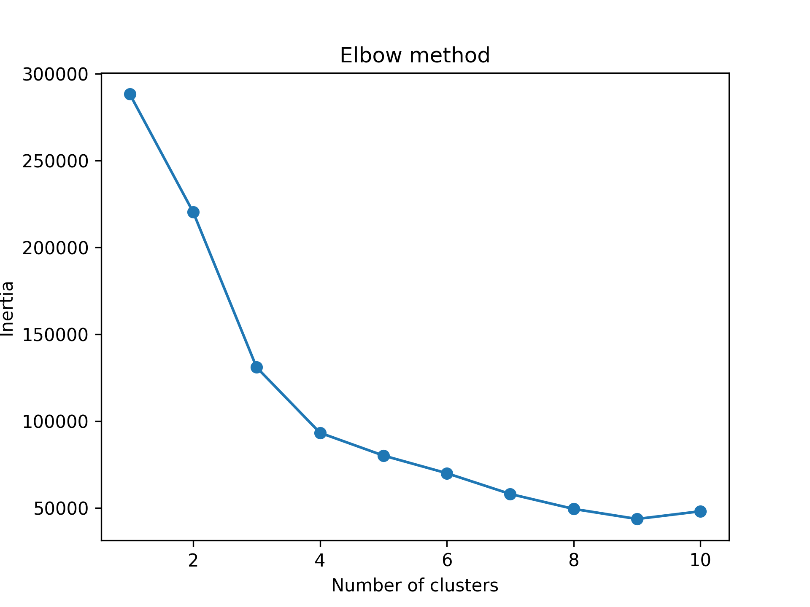
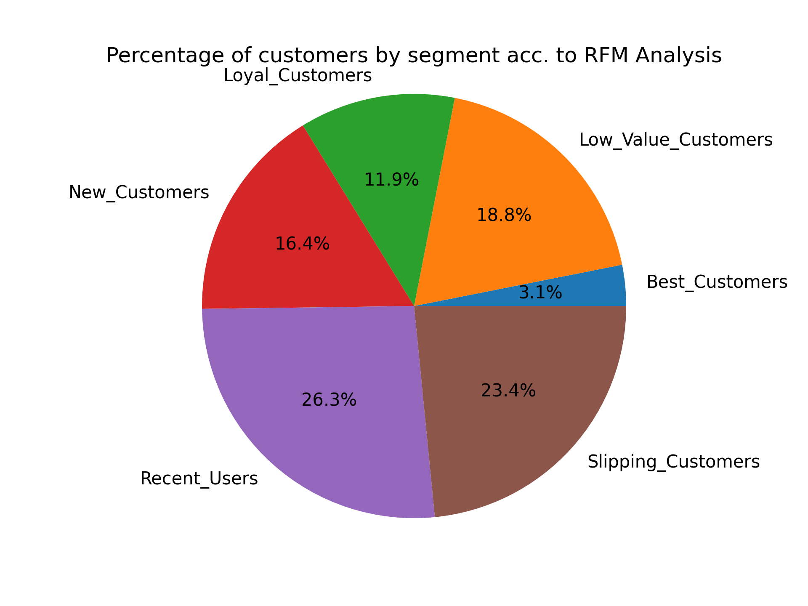

**Executive Summary**:  
I analyzed 119k+ Brazilian e-commerce orders in order to segment 96k+ unique customers into actionable customer groups from a marketing point of view in order to help the Brazilian firm "Olist" to conceive retention programs, evaluate logistics, and to identify high-value customers. First, I merged the 7 separate data sets using key columns, then I created histograms for the numeric features and top10-category-countplots for the categorical features to obtain first insights. Thereafter, I created a separate array with numerical values that represent the 3 dimensions of a Recency-Frequency-Monetary (RFM) model that is commonly used in order to segment unique customers by means of the unsupervised k-means algorithm. In this case, 6 centroids were chosen by applying the Elbow method. Kmeans initializes the centroids for the clusters randomly and then minimizes the Euclidian distance between the data points an the centroids for each cluster until convergence (for details see https://stanford.edu/~cpiech/cs221/handouts/kmeans.html). Before running the algorithm, a log-transformation and a standard-normal scaling was applied to the data to account for the right (positive) skewness and the heavy tails caused by more frequently occuring extreme outliers compared to a Gaussian distribution that were found in the raw frequency and monetary data. Recency describes the number of days that have passed since the last purchase compared to a reference data (Oct 18, 2018). Frequency refers to the number of purchases made and Monetary refers to the sum of price and freight value per unique customer. After running the algorithm, I analyzed the clusters and labeled them accordingly. The customer segments of interest are as follows: low value customers, loyal customers, recent users, best customers, new customers and slipping customers.

**Key insights from the exploratory data analysis**:
- the Brazilian seller_state "SP" and the seller_city "Sao Paulo" are by far the most frequent. Sao Paulo is also the most frequent customer city, followed by Rio de Janeiro and "SP" is also the most frequent customer_state

**Key insights from the RFM analysis**:
- Recency is measured as the no. of days between the most recent order in the entire dataset (Oct 18, 2018) and each customer's last purchase date), Frequency is quantified as the count of unique orders per customer, and Monetary is the sum of price and freight value per customer
- both frequency and monetary are very skewed and exhibit a heavy tails distribution. This means that in the tails of the distribution, very few customers spend a lot more than average and purchase more frequently than just once
- more than 75% of customers didn't make more than one purchase and the max number of purchases by a unique customer is 17.
- 50% of customers haven't made a purchase for 269 days or ~9 months as of October 18, 2018 (the last transaction in the data set)
- The heatmap for each customer segment visualizes the relative importances of each RFM dimension, which are calculated as the diffences between the cluster or segment mean and the global mean for the entire data set. Green signifies positive from a business lens, yellow represents moderate and orange visualizes a negative impact from a business perspective
  

**Key insights from the cluster analysis**:
- approximately 3,000 customers (3%) fall into the "best customers" segment, which is characterized by the highest frequency values and the second highest monetary values.
- 18,000 customers (19%) can be considered "low value" from a business lens due to the fact that this segment exhibits high recency values (last purchase occured long ago) and low monetary values.
- About 22,500 customers (23%) are slipping away according to this analysis since customers in this segment tend to spend the second lowest amount of money and they tend to range in the second lowest recency value range (they purchased recently).
- 11,400 customers (12%) can be considered as loyal customers. The latter segment is characterized by the highest monetary values combined with a moderate recency.

**Strategic recommendations**:
- a local warehouse in Sao Paulo or at least in the state "SP" makes sense logistically
- a "win-back" campaign would be in order to act on the insight that 50% of customers have been "hibernating", i.e. they haven't made a purchase in 9 months or more.
  

**Visualizations**:   
    

    

  

  

**Tables**:     
[Summary Statistics on the preprocessed RFM data](tables/rfm_df_summarystats.csv)    

[Summary Statistics on the 6 generated customer segments](tables/cluster_analysis.csv)
|                         |   Low_Value_Customers |   Loyal_Customers |   Recent_Users |   Best_Customers |   New_Customers |   Slipping_Customers |
|:------------------------|----------------------:|------------------:|---------------:|-----------------:|----------------:|---------------------:|
| ('recency', 'mean')     |                347.14 |            290.29 |         444.29 |           269.21 |           90.09 |               208.01 |
| ('recency', 'median')   |                327    |            275    |         435    |           249    |           86    |               205    |
| ('recency', 'min')      |                 42    |             53    |         286    |             1    |            1    |               123    |
| ('recency', 'max')      |                765    |            744    |         773    |           741    |          144    |               306    |
| ('recency', 'std')      |                121.48 |            126.84 |          99.1  |           145.35 |           23.23 |                45.15 |
| ('frequency', 'mean')   |                  1    |              1    |           1    |             2.12 |            1    |                 1    |
| ('frequency', 'median') |                  1    |              1    |           1    |             2    |            1    |                 1    |
| ('frequency', 'min')    |                  1    |              1    |           1    |             2    |            1    |                 1    |
| ('frequency', 'max')    |                  1    |              1    |           1    |            17    |            1    |                 1    |
| ('frequency', 'std')    |                  0    |              0    |           0    |             0.52 |            0    |                 0    |
| ('monetary', 'mean')    |                 42.05 |            581.63 |         138.01 |           345.7  |          123.02 |               123.48 |
| ('monetary', 'median')  |                 42.32 |            411.62 |         124.1  |           243.86 |           96.88 |               114.42 |
| ('monetary', 'min')     |                  0    |            215.57 |          48.55 |             0    |            0    |                38.13 |
| ('monetary', 'max')     |                 75.07 |          13664.1  |         467.2  |          7571.63 |         1024.76 |               291.44 |
| ('monetary', 'std')     |                 15.01 |            556.35 |          61.25 |           389.2  |           93.23 |                50.81 |
| ('cluster', 'count')    |              18072    |          11400    |       25319    |          2997    |        15783    |             22524    |

**Data Source**:   
https://www.kaggle.com/datasets/olistbr/brazilian-ecommerce

